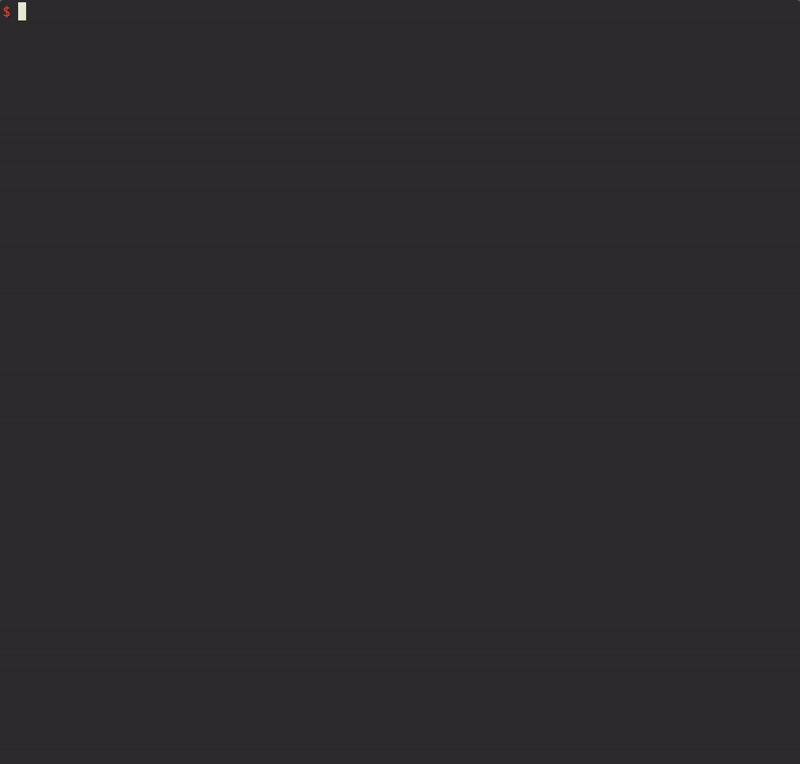

cftool
===

[](https://circleci.com/gh/tetratom/cftool)

cftool ("CloudFormation Tool") is a boring command-line program for working with CloudFormation. It is mainly a tool for reviewing change sets, as well as monitoring the progression of a stack update from the command line. **It works with any existing CloudFormation templates, and does not apply nor require any preprocessing of its own.**

# Installing

- [Download latest Linux binary](https://github.com/tetratom/cftool/releases/latest/download/linux-amd64.zip)
- [Download latest Windows binary](https://github.com/tetratom/cftool/releases/latest/download/windows-amd64.zip)
- [Download latest macOS binary](https://github.com/tetratom/cftool/releases/latest/download/darwin-amd64.zip)
- Alternatively: `go get github.com/tetratom/cftool`.

# Table of Contents

- [Installing](#installing)
- [Table of Contents](#table-of-contents)
- [Quick Start](#quick-start)
- [Development](#development)
- [Usage](#usage)
- [Features and Usage](#features-and-usage)
    - [General Options](#general-options)
    - [Update Stack](#update-stack)
    - [Deploy Stack from Manifest](#deploy-stack-from-manifest)
- [Manifest Files](#manifest-files)
    
# Quick Start

```bash
$ cftool --help
$ cftool --profile MyCompany update --template template.yml --parameter-file params.json --stack-name my-stack --diff
```



# Development

- Run `go generate ./manifest` if the schemas have been updated.
- Test with `go test ./...`.
- Run `make` to build for all targets. Output will be written to `.build`.

# Features and Usage

```sh
$ cftool [general-options] [subcommand] [subcommand-options]
```

### General Options

```
-p/--profile PROFILE: override AWS profile.
-r/--region REGION: override default AWS region.
-e/--endpoint ENDPOINT: override CloudFormation endpoint.
-v/--verbose: enable verbose output.
-c/--color on|off: enable or disable colorized output (default: on). 
```

## Update Stack

This is essentially equivalent to `aws cloudformation create-change-set` followed by `aws cloudformation execute-change-set`, plus some `describe-stack` operations to monitor the status of a deployment. The program will exit when the stack update is complete. If an error is encountered and the stack rolls back, cftool prints these errors and waits for rollback completion. Stack outputs are written out at the end of a successful update.

Example:

```sh
$ cftool -p live update \
    -t templates/base/network.yml \
    -p stacks/live/eu-west-1/live-base-network.json \
    -n live-base-network
```

The default behaviour is to display a summary of the change set, and to prompt the user for confirmation before executing it. This can be bypassed with `-y/--yes`, although it will still ask if the stack doesn't exist at all.

The optional `-d` parameter will display a diff comparing the current and updated templates if the operation is a stack update.

### Usage

```
cftool [general-options] update -t FILE [-p FILE ...] [-P KEY=VALUE ...] [-n NAME] [-d] [-y]

-t/--template FILE: path to CloudFormation template.
-p/--parameter-file FILE: path to CloudFormation parameter value.
-P/--parameter KEY=VALUE: override parameters directly.
-n/--stack-name NAME: override stack name.
-d/--diff: show a diff comparing the stack's template in CloudFormation to the template on disk. 
-y/--yes: do not prompt for confirmation when updating the stack.
```

If `-n NAME` is not provided, it is derived based on the following rules:

1. If there is exactly one `-p FILE`, take the name of the file without its extension.
2. Otherwise take the name of the `-t FILE` without its extension.

The `update` feature is optimised for a one-to-one correspondence between parameter files and stacks.   

## Deploy Stack from Manifest

A manifest file (typically `.cftool.yml` at the root of a repository) is used to declare a matrix of tenants and stacks. This manifest is a complete description of the templates, parameter files, stack names, and other information such as applicable AWS regions. The manifest supports templating to prevent repetition.

Example:

```sh
$ cftool -p live deploy -t live -s network
```

### Usage

```
cftool [general-options] deploy -t TENANT -s STACK [-f FILE] [-d] [-y]

-t/--tenant TENANT: tenant from the manifest.
-s/--stack STACK: stack from the manifest.
-f/--manifest FILE: path to manifest (default: .cfn-tool.yml in a parent directory).
-d/--diff: show a diff comparing the stack's template in CloudFormation to the template on disk. 
-y/--yes: do not prompt for confirmation when updating the stack.
```

# Manifest files

A manifest file (`.cftool.yml`) is a cookbook for setting up and updating stacks. `cftool deploy` will look for a manifest in a parent directory.

It broadly consists of two major sections: (1) tenants; and (2) stacks. By running `cftool deploy -t TENANT -s STACK`, the tenant and stack settings are merged together to form a _deployment_, which describes the template, parameter files, name, region, and other properties of a stack. This allows you to make use of a standard structure and vocabulary when initiating stack changes, and can be used to smooth out irritating inconsistencies (e.g. differences in naming convention for the same stack in different regions).

Here is an example manifest. The full structure is defined in JSON Schema form by [manifest/schemas/manifest.yml](./manifest/schemas/manifest.yml).

```yaml
AccountId: "111111111111" # Supports template.
Parameters:
  - File: "stack-parameters.json" # Supports template.
  - File: "stack-parameters.yml"
  - Key: ExampleKey
    Value: "ExampleValue" # Supports template.
Protected: false
Region: eu-west-1 # Supports template.
StackName: "my-stack" # Supports template.
Template: "my-template.yml" # Supports template.

Version: "1.1"

Global:
  Constants:
    LiveAccountId: "111111111111"
    TestAccountId: "222222222222"
  Default:
    Region: eu-west-1
    Parameters:
      - Key: Environment
        Value: "{{.Tags.Env}}"

Tenants:
  - Label: live
    Default:
      AccountId: "{{.Constants.LiveAccountId}}"
      Protected: true
    Tags:
      Env: live
  - Label: test
    Constants:
      Some: const
    Default:
      AccountId: "{{.Constants.TestAccountId}}"
    Tags:
      Env: test

Stacks:
  - Label: mystack
    Default:
      Template: "templates/{{.StackLabel}}.yml"
      Parameters:
        - File: "stacks/{{.TenantLabel}}/{{.Region}}/{{.StackName}}.json"
      StackName: "{{.Tags.Env}}-mystack"
    Targets:
      - Tenant: live
      - Tenant: test
        Override:
          StackName: "testt-mystack"
```

If the above were a real manifest linked to real templates, an invocation such as `cftool deploy -t live -s mystack` would assemble the following deployment:

```yaml
Constants:
  LiveAccountId: "111111111111"
  TestAccountId: "222222222222"
TenantLabel: "live"
StackLabel: "mystack"
Tags:
  Env: "live"
AccountId: "111111111111"
Region: "eu-west-1"
StackName: "live-mystack"
TemplateURL: "templates/mystack.yml"
Parameters:
  Environment: "live"
  # Remaining parameters derived from stacks/live/eu-west-1/live-mystack.json.
```

Templating allows for some data reuse using the `text/template` syntax. Replacements are applied after tenant and stack selection by merging globals, then tenant, then stack. The following structure is an example of the available values. Note that with the exception of the first three, fields become available for templating in the order given: for example, `.AccountId` can refer to values from `.Tags`, but not `.Region`. 

```go
type Template struct {
	Constants   map[string]string // NO templating support.
	TenantLabel string // NO templating support
	StackLabel  string // NO templating support
	Tags        map[string]string
	AccountId   string
	Region      string
	StackName   string
}
```

More examples can be found in the [manifest/testdata](manifest/testdata) directory. Note that a templated value will have to be surrounded by quotation marks to de-conflict YAML.
